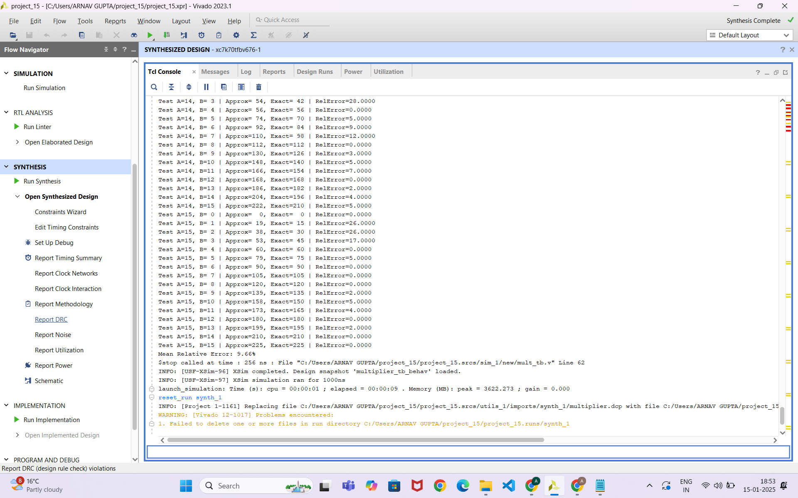

# approximate_multiplier
This project is in verilog language and deals with the construction of an approximate 4X4 multiplier 

The logic I used in this project was that I first constructed an exact 4X4 bit multiplier using full adder and half adder modules.
Then I constructed a modified full adder module named full_adderm
I replaced the 3 full adders used for the lower sum bits by full_adderm 
This brought down my LUTs to 12 and Mean Relative Error to a mere 9.66%

In the modified full adder module , I used an approximation that :-
If the inputs to a full adder are A,B,Cin then we have :
SUM = B 
CARRY = A

Mean Relative error screenshot - 

Report Power screenshot - 

Report Utilisation screenshot - 

Number of LUTs used - 12
![no. of LUTS screenshot] - (screenshots/Number_Of_LUTs.png)
